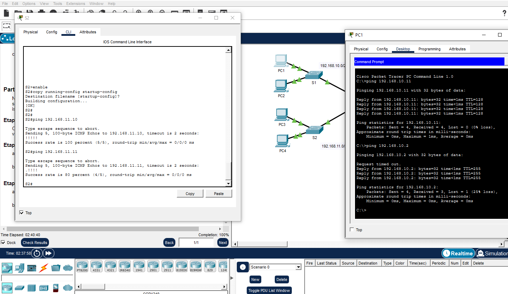

# Solucionar-problemas-de-gateway-padrão-utilizando-o-Packet-Tracer
Atividade prática realizada no Cisco Packet Tracer sobre a solução de problemas relacionados ao gateway padrão.

Objetivo

Identificar problemas relacionados ao gateway padrão, solucioná-los e testar a conectividade para verificar se as correções foram bem-sucedidas.

Ferramenta utilizada

Cisco Packet Tracer

O que foi praticado
Identificação do gateway padrão e dos endereços IP configurados nos dispositivos, usando tanto CLI nos switches quanto o IP Configuration, na área Desktop, nos PCs;

Uso de comandos no CLI, como show running-config, para verificar as configurações de cada dispositivo;

Testes de conectividade utilizando ping;

Identificação de erros nos dispositivos para descobrir por que os testes de ping não estavam funcionavam;

Correção do gateway padrão e dos endereços IP dos switches usando os comandos ip default-gateway e ip address;

Salvamento das configurações no CLI usando copy running-config startup-config;

Teste da comunicação após as correções, usando o CLI dos switches e o Desktop dos PCs.

Resultado

Após identificar que alguns PCs estavam com endereços IP errados e estavam impedindo a comunicação, realizei as correções e testei de novo a comunicação nos dispositivos. Nos switches, verifiquei se possuiam endereços IP e o gateway. implementei o gateway padrão e configurei os endereços IP para permitir a comunicação na rede.

Após essas correções, foi possível restabelecer a comunicação entre os dispositivos de ambas as redes.

